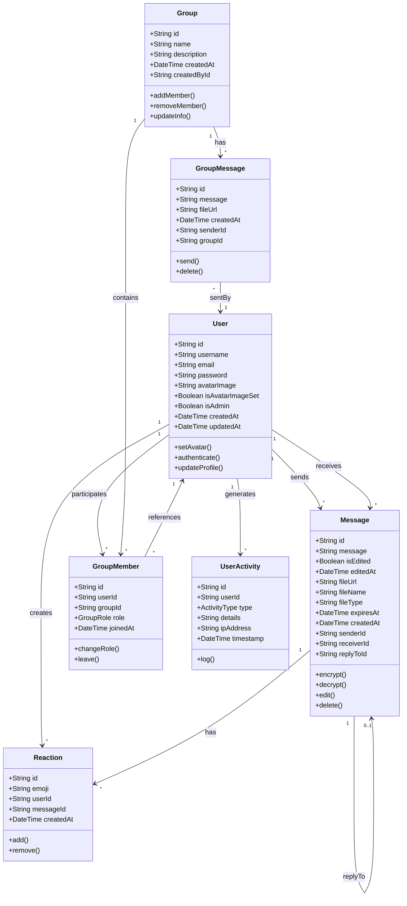
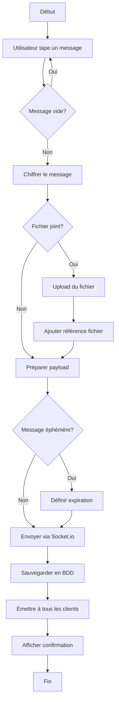
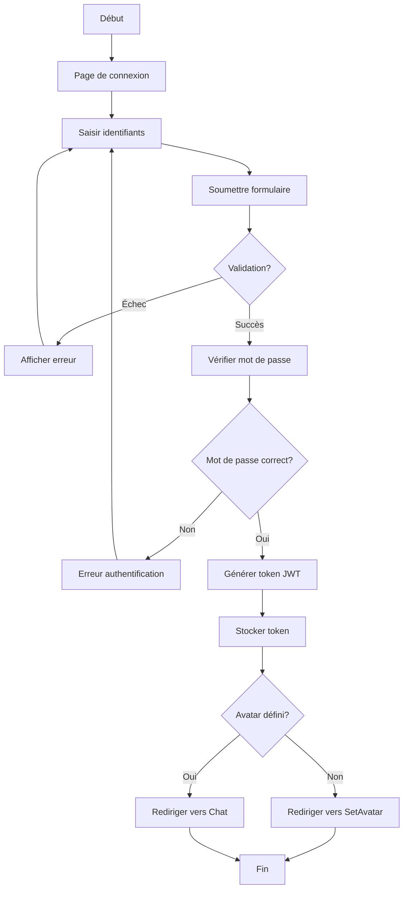
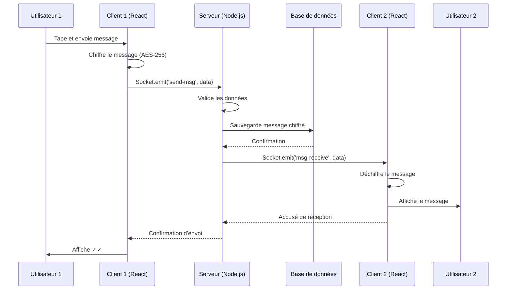
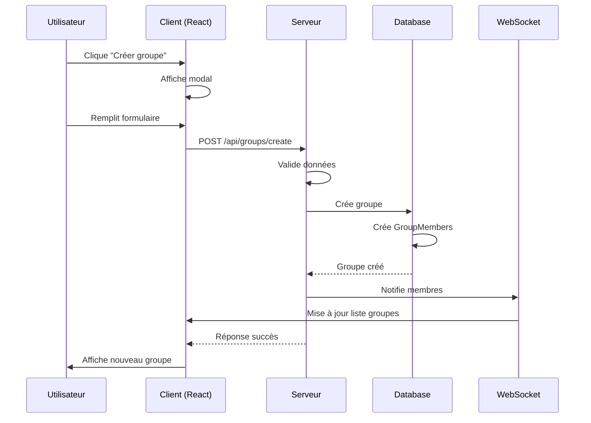

# Documentation Technique - SecureChat

## Sommaire

1. [Introduction](#introduction)
2. [Règles de gestion](#règles-de-gestion)
3. [Diagramme de classes](#diagramme-de-classes)
4. [Diagramme d'activité](#diagramme-dactivité)
5. [Diagramme de séquence](#diagramme-de-séquence)
6. [Architecture technique](#architecture-technique)
7. [Sécurité](#sécurité)
8. [Conclusion](#conclusion)

---

## Introduction

SecureChat est une application de messagerie instantanée sécurisée développée avec les technologies modernes du web. Elle offre une communication en temps réel avec chiffrement de bout en bout, gestion des groupes, partage de fichiers et de nombreuses fonctionnalités avancées.

### Technologies utilisées
- **Frontend** : React.js, Tailwind CSS, Socket.io-client
- **Backend** : Node.js, Express.js, Socket.io
- **Base de données** : PostgreSQL avec Prisma ORM
- **Authentification** : JWT (JSON Web Tokens)
- **Chiffrement** : Crypto-JS (AES-256)
- **Temps réel** : WebSocket via Socket.io

---

## Règles de gestion

### RG1 - Gestion des utilisateurs

**RG1.1 - Inscription**
- Tout utilisateur doit fournir un nom d'utilisateur unique et un mot de passe
- Le mot de passe doit contenir au moins 8 caractères
- L'email est optionnel mais recommandé pour la récupération de compte
- Un avatar doit être sélectionné après l'inscription

**RG1.2 - Authentification**
- L'authentification se fait via nom d'utilisateur et mot de passe
- Un token JWT est généré après connexion réussie
- Le token expire après 24 heures
- Les mots de passe sont hachés avec bcrypt (10 rounds)

**RG1.3 - Profil utilisateur**
- Chaque utilisateur peut modifier son avatar
- Le nom d'utilisateur ne peut pas être modifié après création
- Le statut en ligne/hors ligne est automatiquement géré

### RG2 - Gestion des messages

**RG2.1 - Envoi de messages**
- Un message ne peut être envoyé qu'à un contact existant
- Les messages sont chiffrés avant envoi (AES-256)
- La longueur maximale d'un message est de 5000 caractères
- Les messages sont horodatés côté serveur

**RG2.2 - Types de messages**
- Messages texte simples
- Messages avec fichiers joints (max 10MB)
- Messages éphémères (auto-destruction après délai)
- Réponses à des messages existants

**RG2.3 - Modification et suppression**
- Un utilisateur peut modifier ses propres messages dans les 15 minutes
- Un utilisateur peut supprimer ses propres messages à tout moment
- Les messages supprimés affichent "Message supprimé"
- L'historique de modification est conservé

**RG2.4 - Réactions**
- Maximum 6 types de réactions par message
- Un utilisateur ne peut mettre qu'une réaction par type
- Les réactions sont visibles par tous les participants

### RG3 - Gestion des groupes

**RG3.1 - Création de groupes**
- Un groupe doit avoir un nom unique
- Le créateur devient automatiquement administrateur
- Un groupe peut contenir entre 2 et 50 membres
- La description est optionnelle (max 500 caractères)

**RG3.2 - Rôles dans les groupes**
- **Admin** : Peut tout faire (ajouter/retirer membres, modifier groupe, supprimer groupe)
- **Modérateur** : Peut ajouter des membres et modérer les messages
- **Membre** : Peut envoyer des messages et quitter le groupe

**RG3.3 - Messages de groupe**
- Les messages de groupe sont chiffrés avec une clé partagée
- Tous les membres voient l'historique complet
- Les notifications système (membre ajouté/retiré) sont automatiques

### RG4 - Gestion des fichiers

**RG4.1 - Types de fichiers autorisés**
- Images : JPG, PNG, GIF, WebP (max 5MB)
- Documents : PDF, DOC, DOCX, TXT (max 10MB)
- Vidéos : MP4, WebM (max 50MB)
- Audio : MP3, WAV, OGG (max 20MB)

**RG4.2 - Stockage et sécurité**
- Les fichiers sont stockés sur le serveur avec un nom unique
- Les fichiers sont accessibles uniquement aux participants de la conversation
- Les fichiers sont supprimés après 30 jours d'inactivité

### RG5 - Fonctionnalités avancées

**RG5.1 - Recherche**
- Recherche dans les messages par mots-clés
- Recherche insensible à la casse
- Résultats limités à 50 par requête
- Recherche dans toutes les conversations ou conversation active

**RG5.2 - Export de données**
- Export au format JSON ou TXT
- Filtrage par plage de dates
- Les messages sont déchiffrés avant export
- Export limité aux propres conversations

**RG5.3 - Indicateurs de frappe**
- Affichage en temps réel "est en train d'écrire..."
- Timeout après 3 secondes d'inactivité
- Visible uniquement dans les conversations 1-à-1

**RG5.4 - Mode sombre**
- Basculement manuel entre thème clair et sombre
- Préférence sauvegardée localement
- Appliqué à toute l'interface

### RG6 - Sécurité et confidentialité

**RG6.1 - Chiffrement**
- Tous les messages sont chiffrés avec AES-256
- Les clés de chiffrement ne sont jamais stockées en clair
- Chiffrement de bout en bout pour les conversations privées

**RG6.2 - Sessions**
- Déconnexion automatique après 24h d'inactivité
- Possibilité de déconnexion manuelle
- Les tokens expirés sont invalidés

**RG6.3 - Administration**
- Seuls les administrateurs système peuvent accéder au dashboard admin
- Les logs d'activité sont conservés 90 jours
- Possibilité de bannir des utilisateurs

---

## Diagramme de classes



---

## Diagramme d'activité

### Processus d'envoi de message



### Processus de connexion



---

## Diagramme de séquence

### Séquence d'envoi de message en temps réel



### Séquence de création de groupe



---

## Architecture technique

### Architecture 3-tiers

```
┌─────────────────────────────────────────────────────────────┐
│                        Frontend (React)                      │
│  ┌─────────────┐  ┌──────────────┐  ┌──────────────────┐  │
│  │ Components  │  │   Services   │  │   State (Redux)  │  │
│  └─────────────┘  └──────────────┘  └──────────────────┘  │
└─────────────────────────────────────────────────────────────┘
                              │
                    Socket.io / HTTP
                              │
┌─────────────────────────────────────────────────────────────┐
│                     Backend (Node.js)                        │
│  ┌─────────────┐  ┌──────────────┐  ┌──────────────────┐  │
│  │   Routes    │  │ Controllers  │  │   Middleware    │  │
│  └─────────────┘  └──────────────┘  └──────────────────┘  │
└─────────────────────────────────────────────────────────────┘
                              │
                          Prisma ORM
                              │
┌─────────────────────────────────────────────────────────────┐
│                   Database (PostgreSQL)                      │
│  ┌─────────────┐  ┌──────────────┐  ┌──────────────────┐  │
│  │   Tables    │  │   Indexes    │  │   Contraintes   │  │
│  └─────────────┘  └──────────────┘  └──────────────────┘  │
└─────────────────────────────────────────────────────────────┘
```

---

## Sécurité

### Mesures de sécurité implémentées

1. **Authentification et autorisation**
   - JWT avec expiration
   - Bcrypt pour le hachage des mots de passe
   - Middleware d'authentification sur toutes les routes protégées

2. **Chiffrement des données**
   - AES-256 pour les messages
   - HTTPS pour le transport
   - Clés stockées de manière sécurisée

3. **Protection contre les attaques**
   - Protection CSRF
   - Validation des entrées
   - Limitation du taux de requêtes
   - Échappement des données

4. **Gestion des sessions**
   - Tokens à durée limitée
   - Déconnexion automatique
   - Invalidation des tokens

---

## Conclusion

SecureChat est une application de messagerie moderne et sécurisée qui répond aux besoins actuels de communication en temps réel. L'architecture modulaire et l'utilisation de technologies éprouvées garantissent la scalabilité et la maintenabilité du système.

Les règles de gestion définies assurent un fonctionnement cohérent et sécurisé, tandis que les diagrammes UML permettent une compréhension claire de la structure et du comportement de l'application. 